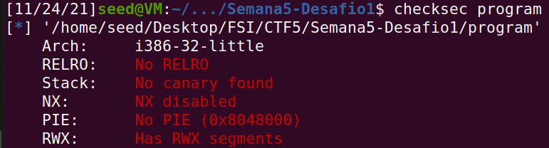

# CTF da semana 5

## Desafio 1
### Análise ao código de main.c

- Conseguimos observar o output da função checksec program.

---

---

### Resposta às perguntas colocadas
#### Existe algum ficheiro que é aberto e lido pelo programa?

- Sim, o ficheiro com o nome guardado em meme_file é aberto para leitura e lido através de fopen.

#### Existe alguma forma de controlar o ficheiro que é aberto?, Existe algum buffer-overflow? Se sim, o que é que podes fazer?

- Se conseguirmos fazer overflow do buffer utilizado para guardar a string obtida por input de modo a escrever por cima do nome do ficheiro anteriormente escrito em memória, podemos conseguir alterar qual o ficheiro que será aberto, lido e impresso na consola.

### Exploração da Vulnerabilidade

- Escrevendo como input uma string que tenha tamanho de 20 caracteres + "flag.txt", tal como "AAAAAAAAAAAAAAAAAAAAflag.txt", o que leva à obtenção da flag quando se realiza isto na aplicação do servidor.

---

## Desafio 2

### Resposta às perguntas colocadas

#### Que alterações foram feitas?, Mitigam na totalidade o problema?

- Foram feitas alterações no código de modo a que exista um valor intermédio, que funciona como uma flag para verificação de input, de modo a ter uma determinada segurança que permite detetar overflows. (se val for alterado)

- Provavelmente não mitiga a totalidade do problema pois o atacante pode conseguir alterar esse valor fazendo input para o buffer de uma maneira "mais calculada", tentando não alterar o valor da variável val.

#### É possivel ultrapassar a mitigação usando uma técnica similar à que foi utilizada anteriormente?

- Penso que sim, como referido anteriormente.

### Exploração da Vulnerabilidade

- Escrevendo como input uma string que tenha tamanho de 20 caracteres + valor aceite pela verificação da variável val "0xfefc2122" + "flag.txt", no ficheiro auxiliar exploit-example.py (usando a notação \xfe para bytes em hexadecimal), conseguimos obter da flag quando corre o script sobre a aplicação do servidor.

## Código
 - O código utilizado para este CTF está na mesma pasta que este ficheiro .md, e inclui a versões do *exploit-example.py* usadas para conseguir fazer exploit de maneira bem sucedida. 