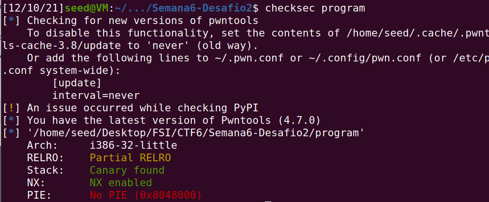

# CTF da semana 6

## Desafio 1
### Análise ao código de main.c

- Conseguimos observar o output da função checksec program.
- O sistema de seguranca PIE não está ativo, o que indica que os endereços do programa são estáticos, podendo levar a uma facilidade de ataques á memória.

---

<!--  - adicionar aqui as imagens-->

---

### Resposta às perguntas colocadas
#### Qual é a linha do código onde a vulnerabilidade se encontra?

- A vulnerabilidade encontra-se na linha de código onde existe um printf onde o conteúdo nao é filtrado. ( printf(buffer), linha 27 )

#### O que é que a vulnerabilidade permite fazer?

- Esta vulnerabilidade premite a injeção de código utilizando format strings.

#### Qual é a funcionalidade que te permite obter a flag?


- Através da função load_flag(), o texto presente no ficheiro file.txt é carregado para um buffer flag[] que vai estar em memória.
- Existe uma maneira de aceder aos conteúdos deste buffer, se conseguirmos utilizar format-strings para obter tanto o endereço deste buffer *flag* como o valor do seu conteúdo.
- A funcionalidade que premite obter a flag é o facto de o argumento '%s', utilizado numa format string, pode imprimir um valor de endereco de memória indicado.

### Exploração da Vulnerabilidade

- Utilizando o gdb é possivel obter o endereço onde a flag é guardada ( 0x804c060 ).
- Como sabemos que os endereços do programa são estáticos, é possivel imprimir o conteúdo desse endereço utilizando a vulnerabilidade do printf.
- Usando o printf para imprimir o endereco corretamente é possivel obter assim a flag.

- Este processo pode ser feito tanto com o comando abaixo como com a nossa versão do **exploit-example.py** para este desafio, presente na pasta code_desafio1.

##  Comando final para obter a flag :
```bash
echo "$(printf "\x60\xc0\x04\x08")-%s" | nc ctf-fsi.fe.up.pt 4004
```

---


## Desafio 2

### Análise ao código de main.c

- Conseguimos observar o output da função checksec program.



### Resposta às perguntas colocadas

#### Qual é a linha do código onde a vulnerabilidade se encontra? E o que é que a vulnerabilidade permite fazer?

- A vulnerabilidade encontra-se na maneira como mandamos o input para o printf(buffer), linha 34, que é 'unsafe' e leva a uma format string vulnerability.

#### A flag é carregada para memória? Ou existe alguma funcionalidade que podemos utilizar para ter acesso à mesma?

- Neste programa, a flag não é carregada para memória, mas talvez alterando o valor da variável 'key' possamos obter algum acesso ao que pretendemos.

#### Para desbloqueares essa funcionalidade o que é que tens de fazer?

- Temos de conseguir alterar o valor da key de 0 para 0xbeef, através do uso de format strings com '%n', que vão permitir alterar esse valor na memória sendo este substituido pelo nº de bits que aparecem antes do caracter especial '%n'.

### Exploração da Vulnerabilidade

- - Utilizando o gdb é possivel obter o endereço onde a key é guardada ( 0x804c034 ).
- Como sabemos que os endereços do programa são estáticos, é possivel alterar o conteúdo desse endereço utilizando a vulnerabilidade do printf.
- Usando o printf e alterando o valor de key de 0 para 0xbeef (através da escrita de 48879 caracteres - *0xbeef convertido para decimal* - antes de inserir um %n no final da string de input), permite-nos ativar a backdoor presente no ficheiro e alcançar o valor da flag, através do comando *cat flag.txt* escrito na shell que se abre.

- Para conseguir obter o resultado pretendido, tanto no programa local como no servidor, utilizámos o ficheiro **exploit_example.py** com input a ser escrito semelhante ao referido a seguir, mas 'compatível' com a linguagem python - visível no ficheiro presente na pasta *code_desafio2*.

## Código
```bash
echo "AAAA$(printf "\x34\xc0\x04\x08")%.48871x%n" | nc ctf-fsi.fe.up.pt 4005
```