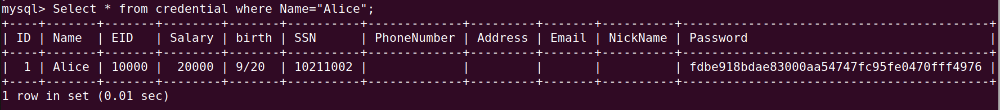
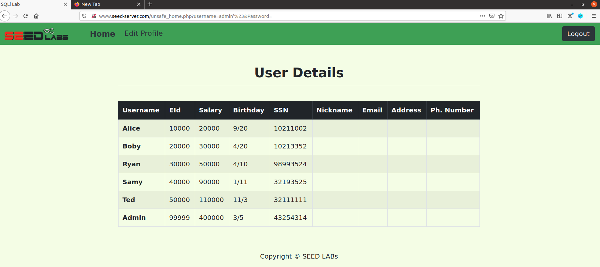
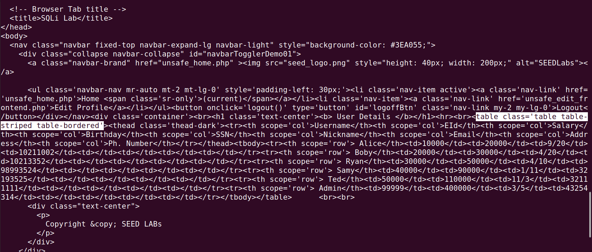
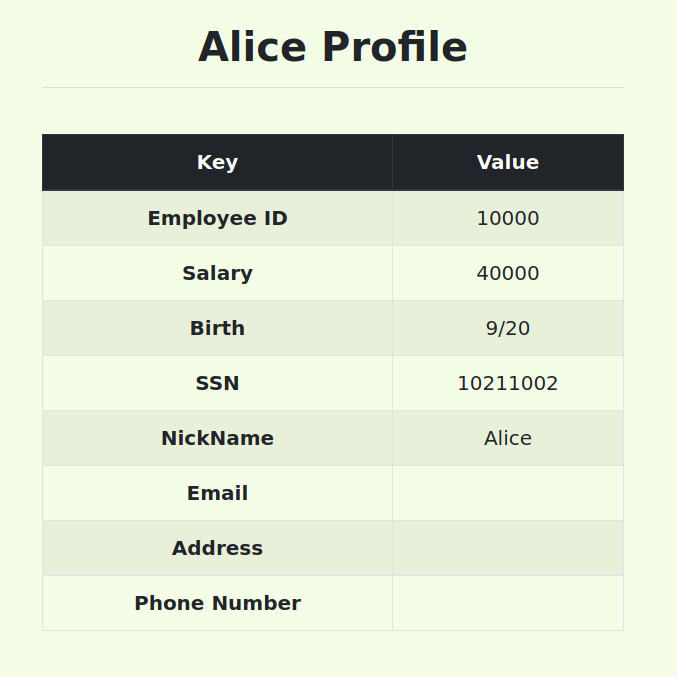
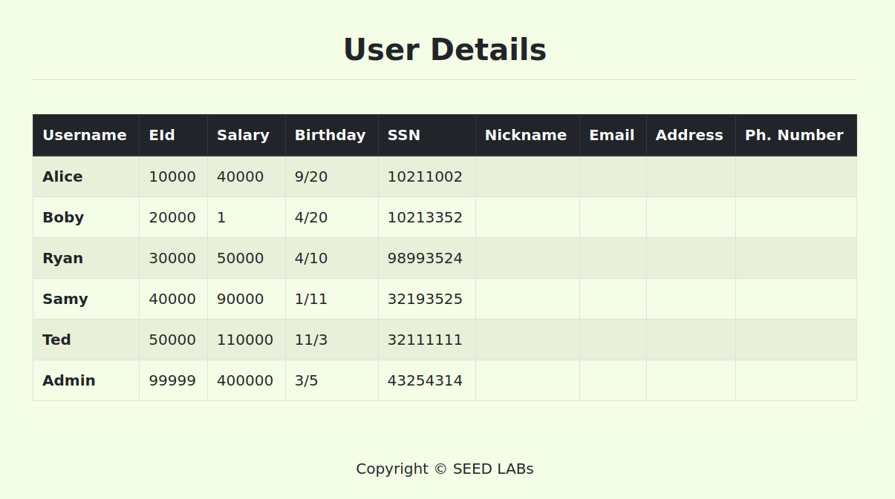

# Trabalho realizado na semana 8 e 9

## **SQL Injection Attack Lab (Tarefas obrigatórias)**

### **Tarefa 1**

- Através do Comando ``SELECT * FROM credential WHERE Name="Alice"``, conseguimos 'imprimir' toda a informação do perfil da funcionária 'Alice'. 

- Abaixo apresentamos um screenshot do resultado.

---

### **Tarefa 2**

#### **Tarefa 2.1**

- Escrevemos no username ``admin' #`` ou ``Admin' #``, o que levou a não ser necessário indicar qualquer password, mas ser possível inicial sessão como admin e obter os registos de todos os funcionários.

- Abaixo apresentamos um screeshot com o resultado obtido.

#### **Tarefa 2.2**

- Escrevendo o seguinte código num terminal `` curl 'http://www.seed-server.com/unsafe_home.php?username=admin%27%23&Password=' `` e conseguimos observar todo o código html utilizado para fazer a página. De seguida apresentamos o output com a parte onde começa a tabela dos dados *highlighted*.

#### **Tarefa 2.3**

- *Countermeasure* encontrada: Achamos que a função php ``query($sql)`` apenas executa a primeira querie presente no seu argumento, mesmo que este seja composto por mais. Provavelmente deve ler até ao 1º ponto e vírgula apenas.

- Na documentação do PHP (acessível em https://www.php.net/manual/en/mysqli.query.php ):
> mysqli::query -- mysqli_query — Performs a query on the database

### **Tarefa 3 (3.1 e 3.2)**

#### **Tarefa 3.1**

- Através da inserção de ``', salary=40000 WHERE EID=10000#`` na input box do nickname, conseguimos alterar o salário da Alice de 20000 para 40000.

#### **Tarefa 3.2**

- Através da inserção de ``', salary=1 WHERE EID=20000#`` na input box do nickname, conseguimos alterar o salário da Boby, através da conta da Alice, de 40000 para 1.

- O que pode ser visto através da tabela de todos os employees acessível pela conta Admin:

